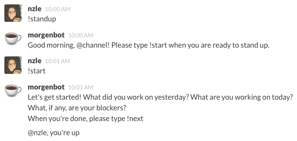

# Morgenbot
Good morning! Morgenbot is a [Slack](https://slack.com/) standup bot. ☕



## Installation

1. Clone the repo
2. `pip install -r requirements.txt`
3. Host the web app on [Heroku](http://heroku.com):

    ```
    heroku create
    git push heroku master
    heroku ps:scale web=1
    heroku logs
    ```
4. Set up some config variables using `heroku config:set VARIBLE=value`:
   - `TOKEN`: your team's Slack API token. (required)
   - `USERNAME`: your bot's username. (optional; defaults to `morgenbot`)
   - `ICON_EMOJI`: the emoji used in the bot's icon. (optional; defaults to `:coffee:`)
   - `CHANNEL`: the channel in which you stand up. (optional; defaults to `#standup`)
   - `IGNORE_USERS`: a list of strings representing channel users who never stand up. (optional; defaults to `[]`)
5. Add the URL where the web app is deployed as an [outgoing webhook](https://my.slack.com/services/new/outgoing-webhook) in Slack. Don't forget the trailing `/`!
6. Type `!standup` in your chosen channel to start a new standup. (Need help? Type `!help`.)

## Thanks
This project takes its inspiration from [tender](https://github.com/markpasc/tender), a standup bot for IRC; leaned heavily on [Slask](https://github.com/llimllib/slask) for its implementation of Flask; and uses the [Slack API](https://api.slack.com/) via the Python wrapper [Slacker](https://github.com/os/slacker). Thank you.

## Contributors
* @eelzon